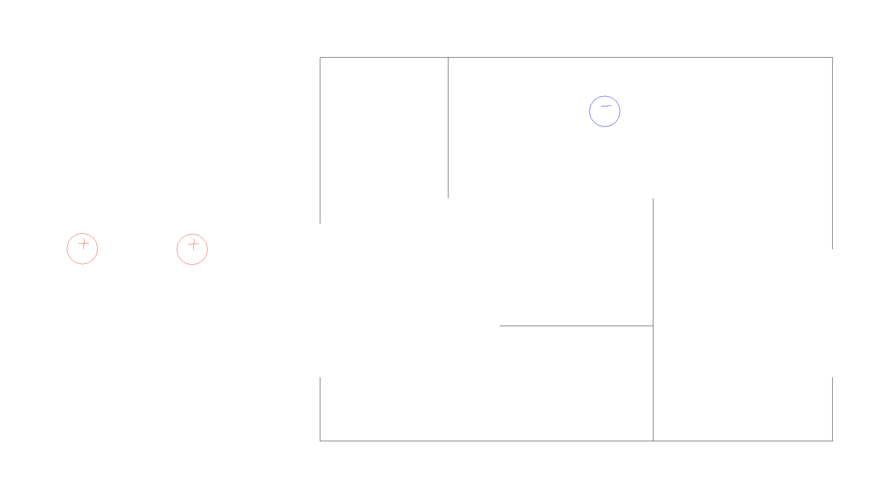

# Coulomb's Maze

Author: Sarah Garland (sgarlan2)

Design: Navigate a maze with electric charges

Screen Shot:

How To Play:

- `Q` to toggle between placing +/- charge (initially set to negative)
- `R` to reset
- `Space` to start/stop
- Left click to place charge
- Right click to remove charge

Strategy: Opposite charges attract and same charges repel. Place a combination of charges around the maze to push/pull your charge from start to finish. 

The idea is to place all your charges and then press play to watch it move through the maze, but that seems to be really hard if not impossible. Instead, placing charges as the player moves seems to work better.

## Extra Credit

Are your Physics Deterministic? If so, how can we verify this? - Yes, you can reset levels and play it again. The equations used are also deterministic.

Are your Physics Rewindable? If so, how can we verify this?

## Math
Using [Coulomb's Law](https://en.wikipedia.org/wiki/Coulomb%27s_law), 
$$
\vec{F}_{player} = \sum_{c \in Charges} \frac{k_e q_{player}q_c}{|\vec{r}_{player} - \vec{r}_c|^3}(\vec{r}_{player} - \vec{r}_c)
$$

where $k_e \approx 8.99 \times 10^9$

Using Newton's Second Law ($\vec{F} = m \vec{a}$),
$$
\vec{a}_{player} = \frac{d^2 \vec{r}_{player}}{dt^2} = \frac{k_e q_{player}}{m_{player}} (\sum_{c \in Charges} \frac{q_c}{|\vec{r}_{player} - \vec{r}_c|^3} (\vec{r}_{player} - \vec{r}_c))
$$

Calculate player position $\vec{r}_{player}$ using [Verlet Integration](https://en.wikipedia.org/wiki/Verlet_integration),

$$
\vec{r}_1 = \vec{r}_0 + \vec{v}_0 \Delta t + \frac{1}{2}\vec{a}(\vec{r}_0)\Delta t^2
$$

$$
\vec{r}_{n+1} = 2\vec{r}_{n} - \vec{r}_{n-1} + \vec{a}(\vec{r}_n)\Delta t^2
$$

This game was built with [NEST](NEST.md).
